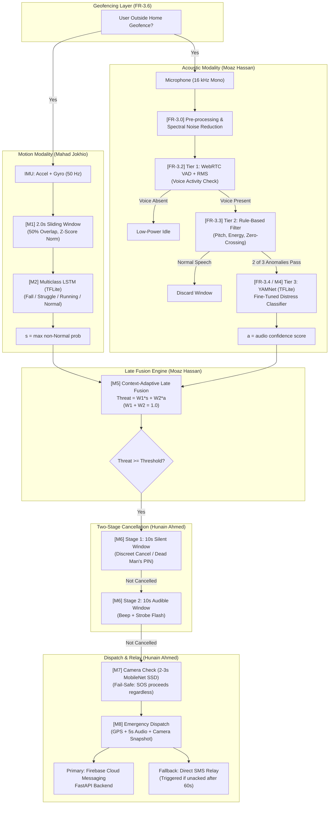

# SheAlert: An Automatic Women Safety System Using Sensors, Audio, and Camera

[]()
[]()
[]()
[]()

> **Final Year Project (FYP) — BS Artificial Intelligence**  
> Department of Creative Technologies, Faculty of Computing & Artificial Intelligence  
> Air University, Islamabad, Pakistan  

---

## 📌 Executive Summary

Existing women safety applications suffer from a fundamental flaw: they require an active physical action—such as unlocking the screen, tapping an SOS button, or shaking the phone. In real-world violent encounters, victims often suffer from **tonic immobility (fear-induced paralysis)**, are physically restrained, or have their phone snatched immediately.

**SheAlert is a fully passive, on-device safety intelligence system.** It operates in the background on an Android device, fusing motion sensors (accelerometer & gyroscope) and acoustic signatures (microphone). When an abnormal pattern of physical resistance or acoustic distress is detected outside the user's home perimeter, SheAlert calculates a unified threat score via context-adaptive late fusion. If a threat is confirmed, the system initiates a two-stage cancellation window (10s silent + 10s audible siren, protected by a covert Duress/Dead Man's PIN) before autonomously dispatching an emergency alert package (GPS coordinates, 5-second audio snippet, and optional camera snapshot) to pre-registered trusted contacts.

---

## 👥 Project Team & Module Ownership

| Team Member | Reg. No. | Role & Module Responsibilities |
|---|---|---|
| **Mahad Jokhio** | 231242 | **Motion & Sensor AI**: Module 1 (Sensor Acquisition & Normalization), Module 2 (Multiclass Motion LSTM, TFLite deployment, placement study). |
| **Moaz Hassan Khan Manj** | 231168 | **Audio AI & Fusion Logic**: Module 3 (Noise Cancellation & Cascaded VAD), Module 4 (Urdu Distress Audio Pipeline & YAMNet Fine-Tuning), Module 5 (Context-Adaptive Late Fusion). |
| **Hunain Ahmed** | 231156 | **System Intelligence & Validation**: Module 6 (Confirmation Window & Duress PIN), Module 7 (Camera Fail-Safe), Module 8 (Alert Package & FCM/SMS Dispatch), Module 9 (Flutter App & User Feedback). |

**Supervisory Committee:**
* **Dr. Samana Batool** (Supervisor, Assistant Professor)
* **Dr. Madiha Yousaf** (Co-Supervisor, Assistant Professor)
* **Ms. Maryam Aamir Ashraf** (Industrial Supervisor, Associate Data Scientist)

---

## 🏛 System Architecture Overview



---

## 📂 Repository Directory Layout

```
SheAlert-Women-Safety-System/
├── README.md                          # Root project guide (this file)
├── SHEALERT_CONTEXT.md                # System specification & proposal requirements
├── docs/                              # Living side-by-side engineering documentation
│   ├── README.md                      # Documentation index portal
│   ├── ARCHITECTURE_OVERVIEW.md       # High-level architecture & design principles
│   ├── MODULE_3_AUDIO_PIPELINE.md     # In-depth audio pipeline & mathematical specs
│   ├── PANEL_PRESENTATION_CHEATSHEET.md # FYP panel defense guide with exact numbers
│   ├── CONTRIBUTING_AND_WORKFLOW.md   # Teammate collaboration & documentation standard
│   └── WORK_LOG.md                    # Chronological engineering work log
├── shealert_audio_pipeline/           # Module 3 & 4 Audio Machine Learning Pipeline
│   ├── config.py                      # Dataset paths, taxonomy, thresholds
│   ├── utils.py                       # Audio QC gate (SNR, dynamic clipping, corrupt handling)
│   ├── consolidate.py                 # Ingestion, QC filtering, manifest generation, 5-fold split
│   ├── loaders/                       # Loaders for 10 acoustic datasets
│   ├── analysis/                      # Combinatorial seed search & clipping analysis
│   ├── output/                        # Manifests, splits, and verification summaries
│   │   ├── unified_manifest.csv       # 30,264 clean clips post-QC
│   │   ├── training_manifest.csv      # 22,368 clips (ambient subsampled to <=40% Normal)
│   │   ├── splits.csv                 # 5-fold group-stratified splits (0 leakage)
│   │   ├── rejected_clips.csv         # 1,692 rejected clips with exact reasons
│   │   ├── SPLIT_INFO.txt             # Split verification and checksums
│   │   └── corpus_summary.txt         # Comprehensive dataset & fold distribution metrics
│   ├── tests/                         # Automated pytest test suites (28 tests)
│   └── requirements.txt               # Audio pipeline Python dependencies
└── audio data set fyp/                # Local raw audio data directories
```

---

## 📊 Audio Pipeline Highlights (Current Completed Work)

* **Multi-Corpus Consolidation:** Unified 10 external datasets (SEMOUR+, UrbanSound8K, UrduSpeech, CREMA-D, ESC-50, UrduSER, AudioSet Screaming, RAVDESS, URDU-Dataset, RealWorld-Urdu) totaling **31,956 raw audio clips**.
* **Adaptive Quality Control (QC):** Built automated filtering in `utils.py` rejecting corrupted files, sub-60ms fragments, and low-SNR noise ($<10\text{ dB}$).
* **Dynamic Clipping Rescue:** Developed a relative dynamic clipping threshold ($\text{Peak} - 0.05 \cdot (\text{Peak} - \text{RMS})$) that **rescued 688 valid high-energy distress screams** from being falsely discarded as clipping distortion.
* **Ambient Subsampling ($\le 40\%$ Normal Cap):** Subsampled ambient datasets down to 800 clips, balancing the training manifest ($22,368$ clips) to **33.4% Distress, 29.6% Aggression, 36.9% Normal**.
* **Zero-Leakage 5-Fold Group Stratification:** Combinatorial optimization (Seed 11) partitioned clips into 5 perfectly balanced folds ($4,458$ clips each, **0.02% size variation**) with **absolute zero group/speaker leakage across folds** and all 9 datasets represented per fold.
* **Isolated OOD Partition:** Isolated *RealWorld-Urdu* ($77$ clips) as an independent out-of-distribution benchmark.
* **Automated Verification:** 28 automated tests covering path formatting, schema invariants, loader functionality, clipping thresholds, and cross-fold zero leakage.

---

## 🛠 Quickstart: Running & Verifying the Pipeline

### 1. Environment Setup
```bash
cd shealert_audio_pipeline
pip install -r requirements.txt
```

### 2. Run Automated Verification Tests
```bash
pytest tests/ -v
```
*(All 28 tests should pass).*

### 3. Generate or Inspect Manifests
```bash
python consolidate.py
```
This inspects all datasets, applies QC filtering, generates `output/unified_manifest.csv`, subsamples ambient sound, applies the balanced 5-fold split, and prints `corpus_summary.txt`.

---

## 📖 In-Depth Documentation Links

* [Architecture Overview](file:///f:/SheAlert-Women-Safety-System/docs/ARCHITECTURE_OVERVIEW.md)
* [Module 3 & 4 Audio Pipeline Specification](file:///f:/SheAlert-Women-Safety-System/docs/MODULE_3_AUDIO_PIPELINE.md)
* [FYP Panel Defense & Presentation Cheatsheet](file:///f:/SheAlert-Women-Safety-System/docs/PANEL_PRESENTATION_CHEATSHEET.md)
* [Team Collaboration & Workflow Guide](file:///f:/SheAlert-Women-Safety-System/docs/CONTRIBUTING_AND_WORKFLOW.md)
* [Engineering Work Log](file:///f:/SheAlert-Women-Safety-System/docs/WORK_LOG.md)
