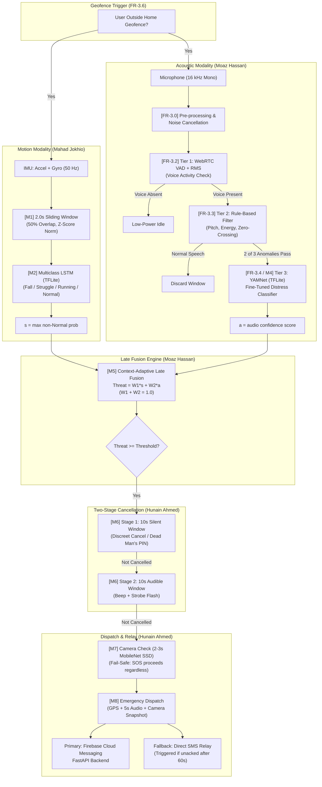

# SheAlert — System Architecture Overview

This document provides a comprehensive architectural breakdown of **SheAlert: An Automatic Women Safety System Using Sensors, Audio, and Camera**. It outlines the end-to-end dataflow, core design principles, module partitions, and operational workflows.

---

## 1. High-Level Concept

Traditional personal safety applications require the victim to manually trigger an alert (pressing a button, shaking the device, or dialing emergency contacts). Under traumatic stress—such as physical assault, threat of violence, or tonic immobility (peritraumatic freezing)—victims are frequently incapacitated or restrained. Furthermore, an attacker may snatch or disable the phone before an alert can be manually issued.

**SheAlert solves this through a fully passive, on-device multi-modal intelligence architecture.** The device autonomously monitors physical motion and ambient acoustics, calculates a continuous threat score, verifies threats via a two-stage cancellation window, and dispatches rich emergency alerts without demanding any explicit user input during an emergency.

---

## 2. End-to-End System Data Flow

---

## 3. The 9 Core System Modules

| Module | Name | Primary Owner | Description & Deliverables |
|---|---|---|---|
| **M1** | Sensor Acquisition & Pre-processing | Mahad Jokhio | Continuous background Android `SensorManager` service sampling Accelerometer and Gyroscope at 50 Hz. 2-second sliding windows with 50% overlap, calibrated z-score normalization. |
| **M2** | Motion Threat Classifier | Mahad Jokhio | Multiclass LSTM neural network running on-device via TensorFlow Lite (TFLite). Evaluates motion dynamics across 4 classes: *Normal*, *Fall*, *Running*, and *Struggle/Physical Resistance*. Outputs sensor threat score $s$. |
| **M3** | Audio Cascade & Energy Filtering | Moaz Hassan | Energy-efficient 3-tier cascade. Tier 1: WebRTC VAD + RMS energy floor. Tier 2: Lightweight DSP rule-based screamer/stress detector. Tier 3: YAMNet invocation trigger. |
| **M4** | Urdu Acoustic Distress Classifier | Moaz Hassan | Pre-trained YAMNet transfer-learning architecture fine-tuned on an expansive multi-source dataset (10 corpora, 30k+ clips) and a custom Urdu distress corpus (Stage 2). Outputs audio threat score $a$. |
| **M5** | Context-Adaptive Late Fusion | Moaz Hassan | Late-fusion algorithmic formulation: $\text{Threat} = W_1 \cdot s + W_2 \cdot a$. Incorporates dynamic weight adaptation based on physical context (e.g., if mic is occluded or user is sprinting). |
| **M6** | Two-Stage Confirmation Window | Hunain Ahmed | 20-second multi-stage safety buffer (10s silent + 10s audible). Incorporates a Dead Man's Switch PIN to prevent coerced cancellations if an attacker forces the victim to unlock the phone. |
| **M7** | Visual Verification Subsystem | Hunain Ahmed | Rapid 2–3 second snapshot capture using camera. Analyzes scene using MobileNet SSD for weapon or person detection. Designed with **strict fail-safe semantics**: camera failure or occlusion never halts the SOS dispatch. |
| **M8** | Alert Package & Dispatch Relay | Hunain Ahmed | Packages exact device coordinates, reverse geocoded address, 5-second audio snippet, and optional camera snapshot. Dispatches via Firebase Cloud Messaging (FCM) to FastAPI backend with a 60-second SMS fallback. |
| **M9** | Flutter Mobile Application | Hunain Ahmed | Complete user interface: onboarding, trusted contact registry, SOS history, safety heatmaps, and post-event feedback loop that tunes per-user sensitivity thresholds ($FR-5.4$). |

---

## 4. Key Engineering & Design Decisions

### 4.1 On-Device Processing (No Cloud AI)
* **Rationale:** Cloud inference introduces variable network latency, total failure in low-connectivity areas (basements, remote roads), and severe privacy risks (streaming personal audio to remote servers).
* **Implementation:** Both the motion LSTM and the acoustic YAMNet model are quantized to FP16/INT8 TFLite binaries, executing fully on the local Android processor.

### 4.2 Late Fusion vs. Early Feature Concatenation
* **Rationale:** Early fusion (concatenating raw motion and audio vectors) creates tight coupling; if the user's phone is inside a thick handbag (microphone muffled), the joint classifier could misinterpret the entire feature vector and fail.
* **Implementation:** Late fusion separates sensor inference from acoustic inference. If one modality degrades, the context-adaptive weighting engine adjusts $W_1$ and $W_2$, allowing sensor-only or audio-only fallback without catastrophic degradation.

### 4.3 3-Tier Cascaded Acoustic Pipeline (Battery Optimization)
* **Rationale:** Running continuous deep learning audio inference burns over 15% battery per hour, making 24/7 background operation unfeasible.
* **Implementation:**
  1. *Tier 1:* WebRTC VAD operates on milliwatt budget, rejecting silence and stationary background hum.
  2. *Tier 2:* Lightweight digital signal processing rules (pitch estimation, zero-crossing rate, RMS energy) discard standard conversational Urdu speech.
  3. *Tier 3:* Heavyweight YAMNet inference is only triggered when anomalous acoustic energy is confirmed.

### 4.4 Two-Stage Confirmation with Dead Man's PIN
* **Rationale:** False positives are inevitable in real-world ML systems. Immediately calling emergency services or alerting family every time a phone drops creates alert fatigue. Conversely, if an attacker grabs the victim's phone, they could cancel a single-tap alert.
* **Implementation:**
  * **Stage 1 (0–10s):** Completely silent countdown with discreet vibration. Allows the user to cancel accidental triggers unnoticed.
  * **Stage 2 (10–20s):** High-intensity audio siren and LED strobe. Deters assailants and alerts bystanders.
  * **Duress / Dead Man's PIN:** If coerced to cancel, entering a reversed or duress PIN visually appears to abort the alarm but silently dispatches an escalated high-priority covert SOS.
