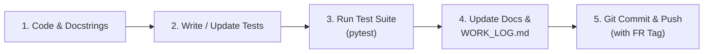

# SheAlert — Collaboration & Side-by-Side Documentation Protocol

This document establishes the official development, collaboration, and documentation guidelines for the SheAlert FYP engineering team (**Moaz Hassan**, **Mahad Jokhio**, **Hunain Ahmed**).

---

## 1. The Core Principle: Side-by-Side Documentation

In academic and production-grade engineering, code without documentation creates technical debt, confusion during team pulls, and panic during panel defense. 

### The Golden Rule
> **"Every commit that changes system logic, data processing, model architectures, or thresholds MUST include corresponding updates to the documentation and test suites."**

When you push code and your teammate pulls your branch, they should be able to read the commit message, check `docs/WORK_LOG.md`, and understand **what** was done and **why** without reverse-engineering lines of code.

---

## 2. The 5-Step Developer Workflow

Whenever working on a new feature, bug fix, or data pipeline improvement:



### Step 1: Code with Informative Docstrings
* Include explanatory comments referencing proposal requirement IDs (e.g. `# [FR-3.2] Tier 1 VAD Energy Check`).
* Avoid cryptic single-letter variables in non-mathematical scopes.

### Step 2: Write or Update Automated Tests
* Place tests in the respective module's `tests/` directory (e.g. `shealert_audio_pipeline/tests/`).
* Ensure tests assert invariants (zero leakage, expected dimensions, valid ranges, exception handling).

### Step 3: Run the Verification Suite
Before committing, run:
```bash
pytest -v
```
Never commit code that breaks existing tests. If an expected behavior intentionally changes, update the test and document the reason.

### Step 4: Update Documentation Side-by-Side
* **Add a new entry to [`docs/WORK_LOG.md`](file:///f:/SheAlert-Women-Safety-System/docs/WORK_LOG.md)** detailing:
  1. Date & Author.
  2. Module affected.
  3. What changed.
  4. Rationale / mathematical justification.
  5. Metrics or impact.
* If a milestone or architecture boundary changes, update the relevant module specification (e.g. [`docs/MODULE_3_AUDIO_PIPELINE.md`](file:///f:/SheAlert-Women-Safety-System/docs/MODULE_3_AUDIO_PIPELINE.md)).
* If a panel-relevant metric changes (e.g. clip counts, fold sizes), update [`docs/PANEL_PRESENTATION_CHEATSHEET.md`](file:///f:/SheAlert-Women-Safety-System/docs/PANEL_PRESENTATION_CHEATSHEET.md).

### Step 5: Structured Git Commit & Push
Follow standardized semantic commit messages tagged with the proposal Requirement ID:

```
<type>(<module>): <short summary> [<FR-ID>]

[Optional detailed body explaining the 'why']
```

**Types:**
* `feat`: New feature or pipeline stage (e.g. `feat(audio): implement webrtc vad tier 1 [FR-3.2]`)
* `fix`: Bug fix (e.g. `fix(qc): adjust dynamic clipping ceiling for screaming audio [FR-4.0]`)
* `test`: Adding or refining tests (e.g. `test(manifest): add group leakage assertion across 5 folds`)
* `docs`: Documentation updates (e.g. `docs(panel): add question defense on late fusion`)
* `refactor`: Code reorganization with no behavior changes

---

## 3. Git Branching Strategy

To avoid merge conflicts across students:
* `main`: Production-ready, stable codebase. Always builds and passes all tests.
* `feature/<student>-<feature-name>`: Active development branches. Examples:
  * `feature/moaz-audio-yamnet`
  * `feature/mahad-motion-lstm`
  * `feature/hunain-flutter-ui`

### Pulling Teammate Updates
When pulling updates from GitHub:
```bash
git checkout main
git pull origin main
# Inspect latest changes:
git log -n 5 --oneline
# Read docs/WORK_LOG.md to see what was delivered
```

---

## 4. Teammate Onboarding & Local Setup

For teammates (Mahad, Hunain) running the audio pipeline on their machines:

1. Clone or pull the repository:
   ```bash
   git pull origin main
   ```
2. Set up virtual environment and install dependencies:
   ```bash
   pip install -r shealert_audio_pipeline/requirements.txt
   ```
3. Run the automated test suite to confirm local environment compatibility:
   ```bash
   cd shealert_audio_pipeline
   pytest -v
   ```
4. Consult `docs/MODULE_3_AUDIO_PIPELINE.md` for complete data pipeline mechanics.
