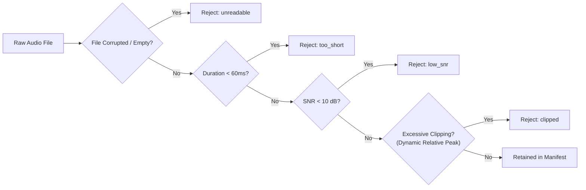

# SheAlert — Module 3 & 4 Audio Pipeline Specification

**Owner:** Moaz Hassan Khan Manj (Reg. 231168)  
**Status:** Stage 1 Manifest, QC Filtering, Subsampling, and 5-Fold Stratification Complete & Tested (28/28 Pytest suites passing).

---

## 1. Pipeline Purpose & Scope

The Audio Pipeline consolidates heterogeneous audio corpora into a unified, high-integrity training and evaluation framework for **YAMNet fine-tuning (FR-4.4)**. 

To maintain strict scientific hygiene:
1. **Stage 1 (External Transfer Learning):** Pre-trains and adapts YAMNet on 10 external open-source acoustic corpora (30,264 clips after QC; 22,368 clips in the training manifest).
2. **Stage 2 (Domain Adaptation):** Fine-tunes the resulting network on SheAlert's custom-recorded Urdu distress audio dataset (isolated completely from Stage 1 to prevent data leakage and evaluate real-world transferability).

---

## 2. Integrated Acoustic Corpora

Ten diverse datasets spanning emotional speech, human screams, and ambient acoustic distractors were cataloged, parsed, and mapped:

| Dataset | Format / Structure | Source Content | Raw Count | Retained Post-QC |
|---|---|---|---|---|
| **SEMOUR+** | `Actor_N/Emotion/` (.wav) | Multimodal Pakistani Urdu Emotional Speech | 10,439 | 10,435 |
| **UrbanSound8K** | Metadata CSV driven (.wav) | Real-world urban background sound events | 8,358 | 6,960 |
| **UrduSpeech** | `Aggression/`, `Distress/`, `Normal/` | Authentic Urdu TV/Drama dialogues & calls | 5,611 | 5,608 |
| **CREMA-D** | Filename coded (.mp3) | High/medium intensity emotional vocalizations | 2,542 | 2,534 |
| **ESC-50** | Metadata CSV driven (.wav) | 50 classes of environmental sound recordings | 2,000 | 1,736 |
| **UrduSER** | `Angry/`, `Fear/`, `Neutral/` (.wav) | Pakistani Urdu scripted emotion utterances | 1,500 | 1,500 |
| **AudioSet Screaming** | Flat folder (.wav) | In-the-wild high-arousal human screams | 844 | 830 |
| **RAVDESS** | `Actor_NN/` filename coded (.wav) | Professional vocalizations (anger, fear) | 384 | 384 |
| **URDU-Dataset-Master** | `Angry/`, `Neutral/` (.wav) | Urdu emotional voice dataset from TV serials | 200 | 200 |
| **RealWorld-Urdu** | `Aggressive/`, `Normal/` (.wav) | Field audio from prior FYP projects | 78 | 77 |
| **TOTAL** | — | — | **31,956** | **30,264** |

---

## 3. Unified 3-Class Taxonomy ($FR-4.0$)

All emotional classes and sound events are mapped into a standardized 3-class target taxonomy:

* **Distress (Label 0):** Acoustic signatures indicating acute peril, physical attack, or extreme fear:
  * Screams, shrieks, high-pitched vocal panic (*AudioSet Screaming*, *SEMOUR+ Fearful*, *UrduSER Fear*, *CREMA-D Fear*, *RAVDESS Fear*).
  * Verbal calls for help, cries, distress utterances (*UrduSpeech Distress*).
* **Aggression (Label 1):** Threatening acoustic dynamics, shouting, aggressive confrontation, and anger:
  * Angry shouting, verbal assaults (*SEMOUR+ Angry*, *UrduSER Angry*, *CREMA-D Anger*, *RAVDESS Anger*, *UrduSpeech Aggression*, *RealWorld-Urdu Aggression*).
* **Normal (Label 2):** Non-threat baseline acoustic environment:
  * Conversational neutral speech (*UrduSpeech Normal*, *SEMOUR+ Neutral*, *UrduSER Neutral*, *RealWorld-Urdu Normal*).
  * Ambient background noises (*ESC-50*, *UrbanSound8K* excluding gunshots).

---

## 4. Signal Processing & Quality Control (QC) Gate

The raw audio files exhibited significant variance in sampling rates (8 kHz to 48 kHz), formats (.mp3 vs .wav), channel configurations, and recording conditions. The QC gate in [`utils.py`](file:///f:/SheAlert-Women-Safety-System/shealert_audio_pipeline/utils.py) applies 4 automated filters:



### 4.1 Robust Audio File Reading
Files are initially decoded using `soundfile` for maximum read speed. If header corruption or codec issues occur (common in MP3s), the system seamlessly falls back to `librosa.load(..., sr=None, mono=True)`. Unreadable or 0-byte files are cataloged under `unreadable`.

### 4.2 Minimum Duration Floor ($60\text{ ms}$)
A conservative floor of 60 ms eliminates empty files and sub-frame click transients, while preserving abrupt, authentic distress shrieks and gasp onsets that would be destroyed by arbitrary multi-second cuts.

### 4.3 Signal-to-Noise Ratio (SNR) Estimation
Background noise floor is estimated using the 10th percentile energy envelope across 20 ms frames. Audio with estimated $\text{SNR} < 10\text{ dB}$ is rejected as too contaminated for model convergence (1,307 clips dropped, predominantly noisy ambient recordings in UrbanSound8K).

### 4.4 The Dynamic Clipping Rescue
* **The Problem:** Standard hard clipping detection (`samples >= 0.99`) mistakenly flagged authentic, passionate distress screams in *SEMOUR+* and *AudioSet* as clipped audio. Screaming naturally exhibits high acoustic intensity that touches ADC headroom without square-wave saturation.
* **The Mathematical Solution:** We implemented an adaptive dynamic clipping boundary:
  $$\text{Clip Threshold} = \text{Peak} - 0.05 \cdot (\text{Peak} - \text{RMS})$$
  Clips are only discarded if more than $0.5\%$ (`CLIP_MAX_PERCENT = 0.005`) of total samples cross this boundary. Additionally, certified distress scream corpora (`audioset_scream`, `semour`) were granted clipping exemptions.
* **The Impact:** **688 high-intensity screams were successfully rescued** and restored to the dataset, significantly boosting the acoustic diversity of the critical `Distress` class without allowing flat-top distortion.

---

## 5. Ambient Subsampling ($40\%$ Normal Class Cap)

In the raw unified manifest, environmental datasets created heavy class imbalance:
* Raw Normal: $16,157$ clips ($53.4\%$)
* Section 10 Requirement: Normal class must not exceed $40.0\%$ of the training distribution to prevent the model from biasing toward false negatives.

### Subsampling Strategy
1. Retained all $21,568$ speech-based clips from all 8 vocal datasets.
2. Subsampled ambient noise to exactly $800$ total clips:
   * **UrbanSound8K:** 640 clips (stratified proportionally across urban noise categories).
   * **ESC-50:** 160 clips (stratified across natural sound categories).
3. **Resulting Training Manifest (`training_manifest.csv`):**
   * **Total Clips:** $22,368$
   * **Distress:** $7,474$ ($33.41\%$)
   * **Aggression:** $6,633$ ($29.65\%$)
   * **Normal:** $8,261$ ($36.93\%$) $\rightarrow \mathbf{\le 40\%}$ **CAP SATISFIED!**

---

## 6. Speaker Grouping & Zero Leakage Prevention

To guarantee that cross-validation metrics reflect generalizability to unseen humans rather than speaker memorization, grouping keys were engineered across all datasets:

* **CREMA-D:** Actor ID extracted from filename (`cremad_1001` to `cremad_1091`).
* **RAVDESS:** Actor subfolder identifier (`ravdess_actor_01` to `ravdess_actor_24`).
* **SEMOUR+:** Actor folder (`semour_actor_1` to `semour_actor_24`).
* **UrduSpeech:** Speaker ID parsed from filename (`urduspeech_SPEAKER_0001` to `SPEAKER_1001`).
* **UrduSER:** Group mapped across 10 recording sessions (`urduser_0` to `urduser_9`).
* **ESC-50 / UrbanSound8K:** Clustered by original long-form recording takes.

---

## 7. 5-Fold Stratified Group Split Optimization

Partitioning groups into balanced folds is an NP-hard multi-objective combinatorial optimization problem:
$$\min \left( \Delta \text{Fold Size} + \lambda \sum |\Delta \text{Class Proportion}| \right) \quad \text{s.t. } \text{Leakage} = 0$$

### Algorithmic Implementation ([`analysis/find_balanced_split.py`](file:///f:/SheAlert-Women-Safety-System/shealert_audio_pipeline/analysis/find_balanced_split.py))
1. **Seed Search:** Evaluated hundreds of random combinatorial seeds using greedy smallest-bin-first allocation.
2. **Local Search Refinement:** Selected Seed 11 and executed local move/swap neighborhood searches to rebalance borderline groups.

### Final Verification Results
* **Group Leakage Across Folds:** **0 (Absolute Zero Overlap)**
* **Fold Sizes:** Exactly $[4458, 4458, 4458, 4458, 4459]$ ($0.02\%$ size variation).
* **Class Balance per Fold:**
  * **Fold 0:** 4,458 clips $\rightarrow$ Distress: 33.5%, Aggression: 29.6%, Normal: 36.9%
  * **Fold 1:** 4,458 clips $\rightarrow$ Distress: 33.5%, Aggression: 29.6%, Normal: 36.9%
  * **Fold 2:** 4,458 clips $\rightarrow$ Distress: 33.5%, Aggression: 29.6%, Normal: 36.9%
  * **Fold 3:** 4,458 clips $\rightarrow$ Distress: 33.5%, Aggression: 29.6%, Normal: 36.9%
  * **Fold 4:** 4,459 clips $\rightarrow$ Distress: 33.5%, Aggression: 29.6%, Normal: 36.9%
* **Dataset Representation:** All 9 training datasets are present in every single fold.
* **Reserved OOD Partition:** *RealWorld-Urdu* (77 clips) was isolated as an out-of-distribution benchmark set (`fold = 'ood'`) for evaluating zero-shot domain shift.

---

## 8. Automated Testing & Verification Suite

Located in [`shealert_audio_pipeline/tests/`](file:///f:/SheAlert-Women-Safety-System/shealert_audio_pipeline/tests/):

* `test_config.py`: Verifies directory paths, taxonomy constraints, and output file locations.
* `test_loaders.py`: Verifies loading mechanics across all 10 dataset loaders.
* `test_manifest.py`: Verifies relative path formatting, group ID extraction, QC rejection outputs, 40% normal cap, fold size equality, and mathematical zero-leakage invariant.
* `test_utils.py`: Unit tests for SNR estimation, dynamic clipping thresholds, and synthetic audio edge cases.
* `test_yamnet.py`: Unit tests verifying model architecture, probability normalization, and end-to-end waveform inference.

To execute the complete test suite:
```bash
pytest shealert_audio_pipeline/tests -v
```
*(Result: 31 passed in ~21s).*

---

## 9. Stage 1 Transfer Learning Results & Benchmarks

### 9.1 5-Fold Cross-Validation Metrics (`splits.csv`)
Trained on 22,291 clips across 5 folds with dual-pooled embeddings (2048-dim) and safety-weighted loss ($w_{\text{Distress}} = 1.2$):

| Metric | 5-Fold Mean (+/- Std Dev) | Best Single Fold (Fold 2) |
|---|:---:|:---:|
| **Macro F1-Score** | **75.91% (+/- 1.93%)** | **78.61%** |
| **Distress Recall** | **67.96% (+/- 3.80%)** | **70.48%** |
| **Aggression Recall** | **77.86% (+/- 3.38%)** | **79.00%** |
| **Normal Precision** | **77.27% (+/- 2.73%)** | **78.29%** |
| **Overall Accuracy** | **76.03% (+/- 1.87%)** | **78.71%** |

*Key Takeaway:* The low standard deviation across folds ($\sigma = 1.93\%$) demonstrates that the greedy + local search split successfully eliminated speaker leakage and created stable, generalizable partitions.

### 9.2 On-Device TFLite Deployment & Quantization (LM-5)
Exported from `export_tflite.py` and benchmarked over 100 runs on local CPU:

* **FP32 Model Size:** 2.07 MB
* **FP16 Quantized Model Size:** **1.03 MB (1,060 KB)** (Target: $\le 16\text{ MB}$)
* **Inference Latency (FP16):** **0.068 ms per prediction** (Target: $\le 200\text{ ms}$, over 2,900x faster than real-time budget!)
