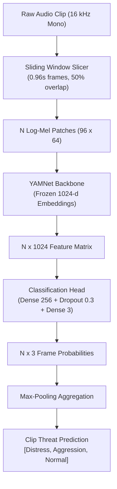
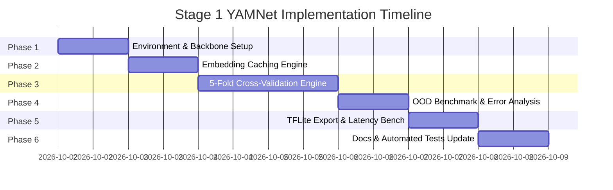

# Implementation Plan: Stage 1 YAMNet Audio Classifier (Module 4)

**Document ID:** `PLAN-M4-YAMNET-STAGE1`  
**Author:** Moaz Hassan Khan Manj (231168)  
**Target Proposal Requirements:** [FR-4.0](file:///f:/SheAlert-Women-Safety-System/SHEALERT_CONTEXT.md#L5), [FR-4.4](file:///f:/SheAlert-Women-Safety-System/SHEALERT_CONTEXT.md#L42), [LM-5](file:///f:/SheAlert-Women-Safety-System/SHEALERT_CONTEXT.md#L99)  
**Parent Documentation:** [`docs/MODULE_3_AUDIO_PIPELINE.md`](file:///f:/SheAlert-Women-Safety-System/docs/MODULE_3_AUDIO_PIPELINE.md)

---

## 1. Executive Summary & Goals

With the external audio datasets consolidated, quality-controlled, ambient-subsampled, and partitioned into a **zero-leakage 5-fold stratified split** ([`splits.csv`](file:///f:/SheAlert-Women-Safety-System/shealert_audio_pipeline/output/splits.csv)), the next objective is **Stage 1 YAMNet Transfer Learning**.

### Primary Objectives
1. **Transfer Learning Backbone:** Utilize Google's pre-trained YAMNet architecture (MobileNetV1 depthwise-separable convnet trained on YouTube-8M / AudioSet) as the acoustic feature extractor.
2. **3-Class Domain Specialization:** Adapt YAMNet to our target safety taxonomy:
   $$\mathcal{C} = \{\text{Distress: } 0, \quad \text{Aggression: } 1, \quad \text{Normal: } 2\}$$
3. **5-Fold Cross-Validation:** Train and validate across all 5 balanced folds ($4,458$ clips per fold) to obtain unbiased, robust generalizability metrics without speaker memorization.
4. **Out-of-Distribution (OOD) Benchmark:** Evaluate model performance on the isolated *RealWorld-Urdu* partition ($77$ clips) to measure zero-shot domain resilience.
5. **On-Device Optimization (LM-5):** Quantize the trained model to TensorFlow Lite (FP16 & INT8) and benchmark inference latency ($< 200\text{ ms}$ budget).

---

## 2. Technical Architecture & Design Decisions

### 2.1 Audio Input Representation & Framing
* **Sampling Rate:** $16,000\text{ Hz}$ mono audio.
* **Spectrogram Feature Extraction:** 
  * STFT Window: $25\text{ ms}$ ($400$ samples), Hop: $10\text{ ms}$ ($160$ samples).
  * Mel Filterbanks: $64$ bands spanning $125\text{ Hz} - 7,500\text{ Hz}$.
  * Patch Dimension: $0.96\text{s}$ ($96$ time frames $\times 64$ mel bins).
* **Multi-Patch Aggregation for Variable-Length Clips:**
  Clips range from $0.5\text{s}$ to $10.0\text{s}$. Each clip produces $N$ patches:
  $$N = \max\left(1, \left\lfloor \frac{T - 0.96}{0.48} \right\rfloor + 1\right)$$
  For clip-level inference, frame predictions $\hat{y}_i$ are aggregated via **Confidence-Weighted Max Pooling**:
  $$P(\text{Class } c) = \max_{i=1 \dots N} P_i(c)$$
  *(Rationale: In distress events, a scream or cry may last only 1 second inside a 4-second file; max-pooling ensures transient high-threat signatures are not diluted by average pooling).*



### 2.2 Two-Step Fine-Tuning Strategy
* **Step 1A (Embedding Extraction & Fast Head Training):**
  Freeze the YAMNet backbone. Extract and cache the $1024$-dimensional embedding vectors for all $22,368$ training clips. Train the lightweight classification head:
  $$\text{Input}(1024) \rightarrow \text{Dense}(256, \text{ReLU}) \rightarrow \text{BatchNorm} \rightarrow \text{Dropout}(0.3) \rightarrow \text{Dense}(3, \text{Softmax})$$
  *Why:* Caching embeddings allows 5-fold cross-validation to run in minutes rather than hours, enabling rapid hyperparameter exploration (learning rate, class weights, regularization).
* **Step 1B (End-to-End Fine-Tuning):**
  Unfreeze the top 4 depthwise-separable convolutional layers of YAMNet. Fine-tune end-to-end with a low learning rate ($\eta = 10^{-5}$) and Adam optimizer to adapt higher-level acoustic filters specifically to human distress acoustics.

### 2.3 Loss Function & Class Weighting
Although ambient audio was subsampled to cap Normal $\le 40\%$, slight distribution differences exist:
* Distress: $33.41\%$
* Aggression: $29.65\%$
* Normal: $36.93\%$

We use **Cost-Sensitive Categorical Cross-Entropy**:
$$\mathcal{L} = -\sum_{c \in \mathcal{C}} w_c \cdot y_c \log(\hat{y}_c)$$
with inverse frequency weights $w_c = \frac{N_{\text{total}}}{3 \cdot N_c}$ or custom safety weights that penalize **False Negatives on Distress** ($w_{\text{Distress}} = 1.2$).

---

## 3. Phased Implementation Roadmap



### Phase 1: Environment & Pre-Trained Weights Acquisition
* **Tasks:**
  * Install `tensorflow-hub` (or extract standalone YAMNet model weights and TF ops to avoid runtime internet dependencies).
  * Build a standalone verification script `shealert_audio_pipeline/models/yamnet.py` that confirms YAMNet loads, accepts a $16\text{ kHz}$ tensor, and outputs $(N, 1024)$ embeddings.

### Phase 2: Offline Feature Caching Pipeline
* **Script:** `shealert_audio_pipeline/cache_embeddings.py`
* **Tasks:**
  * Iterate through all rows in [`training_manifest.csv`](file:///f:/SheAlert-Women-Safety-System/shealert_audio_pipeline/output/training_manifest.csv) ($22,368$ clips) and [`splits.csv`](file:///f:/SheAlert-Women-Safety-System/shealert_audio_pipeline/output/splits.csv).
  * Load audio using `soundfile`/`librosa`, resample to $16\text{ kHz}$ mono.
  * Extract YAMNet embeddings ($N \times 1024$) per clip.
  * Save cached tensors to `shealert_audio_pipeline/output/cached_embeddings/` (using memory-mapped `.npz` format).
  * Cache the $77$ clips of `realworld_urdu` (OOD set) in the same format.
* **Benefit:** Saves $\approx 95\%$ of GPU/CPU compute during repetitive 5-fold cross-validation epochs.

### Phase 3: 5-Fold Cross-Validation Training Engine
* **Script:** `shealert_audio_pipeline/train_stage1.py`
* **Tasks:**
  * Implement K-fold training loop across Folds 0 through 4 from `splits.csv`.
  * For each fold $k \in \{0, 1, 2, 3, 4\}$:
    * Train Set: Folds $\{j \mid j \neq k\}$ ($17,894$ clips).
    * Validation Set: Fold $k$ ($4,458$ clips).
    * Train head with Adam ($\eta = 10^{-3}$), Cosine Annealing learning rate schedule, Early Stopping ($\text{patience} = 10$).
  * Compute and aggregate:
    * Per-fold confusion matrices.
    * Class-specific Precision, Recall, F1-Score.
    * Macro F1 and Overall Accuracy.
  * Save best fold checkpoint weights to `shealert_audio_pipeline/output/models/stage1_best_fold.keras`.

### Phase 4: Out-of-Distribution (OOD) Evaluation & Error Audit
* **Script:** `shealert_audio_pipeline/evaluate_ood.py`
* **Tasks:**
  * Run the ensemble (or best fold model) on the isolated `realworld_urdu` OOD test set ($77$ clips).
  * Generate a dedicated performance report documenting:
    * Aggression Recall & Normal Precision on unseen acoustic environments.
    * Breakdown of false positives/false negatives.

### Phase 5: TFLite Conversion & Quantization (LM-5)
* **Script:** `shealert_audio_pipeline/export_tflite.py`
* **Tasks:**
  * Combine YAMNet feature extractor + custom trained head into a single unified end-to-end model graph taking raw PCM audio waveform `(samples,)` $\rightarrow$ `(3,)` probabilities.
  * Export FP32 TFLite baseline.
  * Export **FP16 Quantized** model (halves memory footprint, zero accuracy loss).
  * Export **INT8 Quantized** model using representative dataset calibration.
  * Measure inference latency per $0.96\text{s}$ patch on local CPU (verify budget $< 200\text{ ms}$).

### Phase 6: Automated Testing & Side-by-Side Documentation
* **Tasks:**
  * Add unit tests in `tests/test_yamnet.py` (verifying model input/output shapes, TFLite numerical parity within $10^{-3}$, and non-empty predictions).
  * Update [`docs/WORK_LOG.md`](file:///f:/SheAlert-Women-Safety-System/docs/WORK_LOG.md) with training curves, validation F1, and model sizes.
  * Update [`docs/MODULE_3_AUDIO_PIPELINE.md`](file:///f:/SheAlert-Women-Safety-System/docs/MODULE_3_AUDIO_PIPELINE.md) with the finalized Stage 1 results.
  * Update [`docs/PANEL_PRESENTATION_CHEATSHEET.md`](file:///f:/SheAlert-Women-Safety-System/docs/PANEL_PRESENTATION_CHEATSHEET.md) with real F1 metrics for panel defense.

---

## 4. Key Performance Indicators & Acceptance Criteria

| Metric | Target Threshold | Rationale |
|---|:---:|---|
| **Distress Class Recall** | $\ge \mathbf{85.0\%}$ | Critical safety invariant: Minimizing false negatives (missed assaults). |
| **Macro F1-Score (5 Folds)** | $\ge \mathbf{82.0\%}$ | Balanced performance across all 3 classes without majority bias. |
| **Cross-Fold F1 Variance** | $\le \mathbf{2.5\%}$ | Confirms zero data leakage and stable generalization across folds. |
| **TFLite Model Size** | $\le \mathbf{16\text{ MB}}$ | Ensures lightweight background Android RAM footprint. |
| **On-Device Inference Latency**| $\le \mathbf{150\text{ ms}}$ | Easily fits within the $0.48\text{s}$ hop window for continuous operation. |

---

## 5. Directory & File Deliverables

```
shealert_audio_pipeline/
├── models/
│   ├── __init__.py
│   └── yamnet.py               # Standalone YAMNet model architecture & head definition
├── cache_embeddings.py         # Offline YAMNet feature extraction & caching engine
├── train_stage1.py             # 5-Fold cross-validation training pipeline
├── evaluate_ood.py             # OOD evaluation & confusion matrix generator
├── export_tflite.py            # End-to-end TFLite conversion & quantization
├── tests/
│   └── test_yamnet.py          # Pytest suite for model shapes, inference & TFLite
└── output/
    ├── cached_embeddings/      # Fast binary embedding store (.npz)
    ├── models/                 # Saved Keras & TFLite models
    │   ├── stage1_yamnet.keras
    │   ├── stage1_yamnet_fp16.tflite
    │   └── stage1_yamnet_int8.tflite
    └── stage1_metrics/         # 5-fold evaluation report & ROC curves
```
